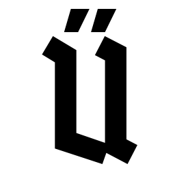

## The Ü programming language
Experimental programming language.  
It is a compilable, statically-typed C++/Rust-like language.

The sources of the compiler for this language and some related tools are located here.
Also standard library sources and documentation sources are located in this repository.

### Documentation

Documentation is available here: [russian](https://panzerschrek.github.io/U-00DC-Sprache-site/docs/ru/contents.html), [english](https://panzerschrek.github.io/U-00DC-Sprache-site/docs/en/contents.html).

### How to build

#### Option 0 - build with LLVM sources.
* Download LLVM sources [here](https://github.com/llvm/llvm-project/releases/) (llvm 15.0.7 used in this project).
* Run cmake for *source/CMakeLists.txt* and generate project for your favorite IDE or build system. You must set LLVM_SRC_DIR in cmake arguments.
* In order to speed-up the build you may disable building of unnecessary targets via LLVM_TARGETS_TO_BUILD cmake variable. For example set it to *X86* only.
* It is recommended to disable LLVM tests and benchmarks. See LLVM documentation for more information.
* Perform the build

#### Option 1 - build with LLVM binary libraries.
* Install proper version of LLVM libraries via your system packet manager or download it manually [here](https://github.com/llvm/llvm-project/releases/).
* Run cmake for *source/CMakeLists.txt* with LLVM_LIB_DIR specified.
* Perform the build.

Some components are optional and may be disabled via cmake options (see *source/CMakeLists.txt*).

Python 3 is required to build and run tests, written in Python.

Sphynx is required to build documentation.

For more information/examples see build scripts in *ci* directory.

### Components

[compiler](source/compilers_common_lib/README.md)

[language server](source/language_server/README.md)

[syntax highlighting](source/syntax_highlighting/README.md)

[standard library](source/ustlib/README.md)

[C++ header converter](source/cpp_header_converter/README.md)

[interpreter](source/interpreter/README.md)

[plugin for QtCreator](source/qt_creator_plugin/README.md)

[documentation](source/docs/README.md)

[examples](source/examples/README.md)

### Downloads

The compiler downloads are available on the actions page - as action artifacts.
It's recommended to use latest build of the *master* branch.

### Authors
Copyright © 2016-2023 "Panzerschrek".
